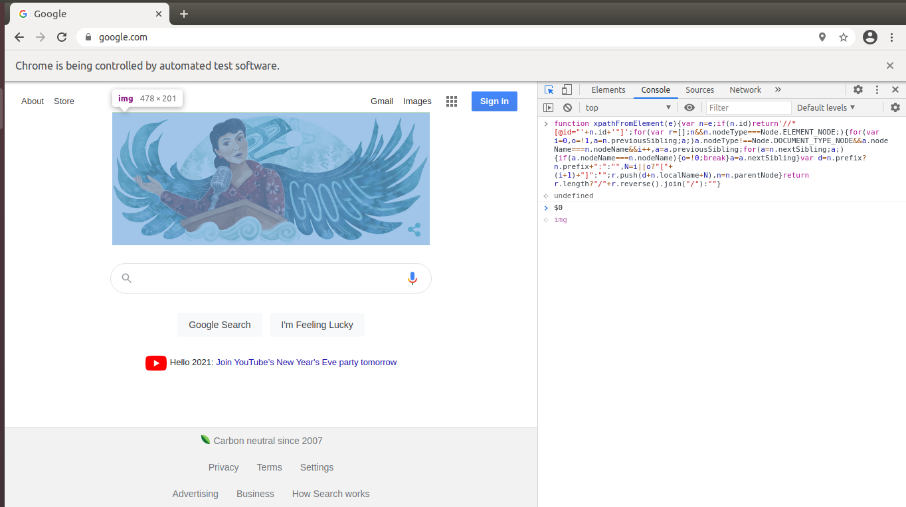

# Browser Automation

Automated browser steps.
****
### Setup:
This repo uses python3.8 and venv for virtual environments.
1. Clone the repo and install python3.8 if you need it along with relevant system packages.
2. Change directory to the project and create your virtual environment.

```bash
# From the project directory create the virtual environment.
python3.8 -m venv venv

# Activate the local python virtual environment.
source venv/bin/activate

# Upgrade pip
venv/bin/python3 -m pip install --upgrade pip

# Install relevant site-packages from requirements.txt.
pip install -r requirements.txt
```
---
### Run Example:
```bash
# From the project directory
source venv/bin/activate

# Run the main.py script.
(venv)$ python3 main.py
```
*Note: network latency will effect the code execution.*
1. Inspect element programmatically while running automation to browse the DOM attributes etc. using devtools.



2. Extend inspection using [DevTools Console Utilities-API](https://developers.google.com/web/tools/chrome-devtools/console/utilities#dom). 


3. Extract the XPath from the inspected element and further inspect the DOM, highlighting the DOM subtree matched by the XPath query. 
   
ToDo:
- Setup better package structure.
- Testing existing inspect element tools.
- Record steps and leverage image recognition.
- Basic DSL to drive the browser steps.
